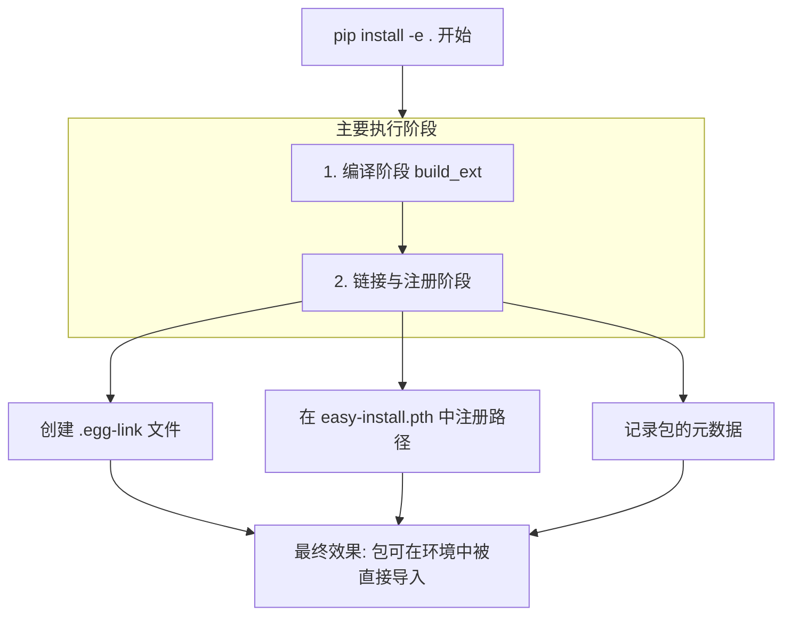

# `pip install -e .` VS `python setup.py build_ext`

你的理解**非常接近本质**，但不完全准确。更精确地说：

**`pip install -e .` 确实会执行 `python setup.py build_ext`（或类似的构建步骤），但它在此基础上，增加了一个关键的“注册和链接”操作，将这个包正式集成到你的Python环境中。**

下面我为你分解一下这个“完整套餐”包含的具体步骤，以及它与单一编译操作的核心区别：

### 📦 `pip install -e .` 完整流程拆解
当你运行 `pip install -e .` 时，幕后会发生以下事情（下图清晰地展示了其复合流程）：

### 🔧 核心区别对比
理解了完整流程后，我们可以用一个简单的表格对比这两个命令的关键区别：

| 对比维度 | `python setup.py build_ext --inplace` | `pip install -e .` |
| :--- | :--- | :--- |
| **核心动作** | **仅编译** | **编译 + 系统注册** |
| **环境集成** | 无。Python环境“不知道”这个包的存在。 | 有。环境通过`.egg-link`和`.pth`文件“知道”这个包及其源码位置。 |
| **导入方式** | 需手动将当前目录加入 `sys.path`。 | 可在任何位置直接`import`。 |
| **包管理** | 不会出现在 `pip list` 中。 | 会出现在 `pip list` 中，并标记为可编辑 (`-e`) 模式。 |
| **依赖处理** | 不处理。 | 会检查并尝试满足`setup.py`中声明的依赖。 |

### 💡 如何选择：以你的 `torch_nndistance` 为例
对于你正在编译的这个**PyTorch C++/CUDA扩展**，建议如下：

| 你的场景 | 推荐命令 | 原因 |
| :--- | :--- | :--- |
| **快速验证编译是否成功** | `python setup.py build_ext --inplace` | 最快。编译完立刻在同目录的测试脚本中`import`测试。 |
| **作为项目依赖进行开发** （需要被其他模块导入） | `pip install -e .` | **推荐**。一劳永逸。之后在其他文件中就能像普通包一样`import torch_nndistance`。 |
| **不确定，想稳妥点** | 1. 先 `python setup.py build_ext --inplace` 编译测试。 2. 成功后，再 `pip install -e .` 安装。 | 分步进行，确保编译无误再进行环境集成。 |

**总结一下**：
你可以把 `python setup.py build_ext --inplace` 看作是“**只生产产品，不上架销售**”。而 `pip install -e .` 则是“**生产产品，并把它正式上架到你个人商店（当前Python环境）里，还允许你随时回工厂（源码目录）修改产品**”。

如果你的目标是长期使用这个 `torch_nndistance` 模块，**直接运行 `pip install -e .` 是最规范、最方便的选择**。
