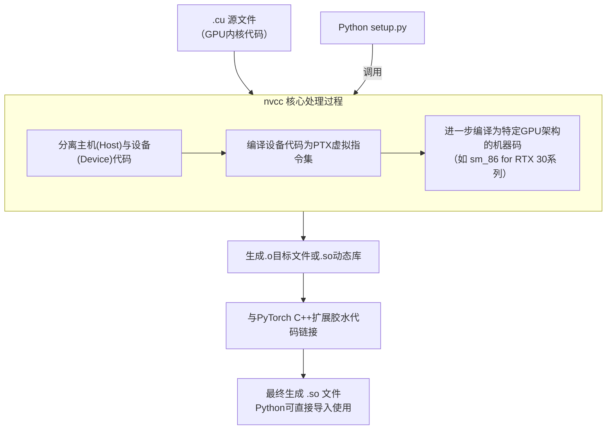

# windows为终端设置conda
1. 更改环境变量
```bash
D:\anaconda3
D:\anaconda3\Scripts
D:\anaconda3\Library\bin
D:\anaconda3\Library\mingw-w64\bin  # 可选，用于编译 C/C++ 代码
D:\anaconda3\Library\usr\bin        # 可选，用于 UNIX 工具的兼容
```

2. 为所有
```bash
conda init --all powershell
```


# 更新ubuntu默认cuda
* 查看当前版本
```bash
(legged-rsl) sky@night:~/Downloads$ ls -l /usr/local/cuda
lrwxrwxrwx 1 root root 22  9月  6 08:46 /usr/local/cuda -> /etc/alternatives/cuda
(legged-rsl) sky@night:~/Downloads$ ls -l /etc/alternatives/cuda
lrwxrwxrwx 1 root root 20  9月  6 08:46 /etc/alternatives/cuda -> /usr/local/cuda-12.4
```

* 查看alternatives并更新
```bash
sudo update-alternatives --config cuda
# 更新
sudo update-alternatives --install /usr/local/cuda cuda /usr/local/cuda-11.8 80
```

* 用环境变量更新
```bash
# 要带上/bin路径
export PATH=/usr/local/cuda-11.7:/usr/local/cuda-11.7/bin:$PATH
export LD_LIBRARY_PATH=/usr/local/cuda-11.7/lib64:$LD_LIBRARY_PATH
```

# 安装CUDA库,避免更新系统驱动Driver

```bash
sudo sh cuda_11.7.0_515.43.04_linux.run --toolkit --silent --override
sudo sh cuda_11.8.0_520.61.05_linux.run --toolkit
```


# pip 特定版本+特定版本的cuda

```python
pip install torchaudio==2.5.1+cu118 --index-url https://download.pytorch.org/whl/cu118
```

# pip安装

- ~/.pip/pip.conf
  
  ```sh
  [global]
  index-url = https://mirrors.aliyun.com/pypi/simple/
  [install]
  trusted-host=mirrors.aliyun.com
  # 清华源: https://pypi.tuna.tsinghua.edu.cn/simple
  ```

- set timeout
  
  ```sh
  pip install package_name --timeout 10
  ```

- 从特定源下载

```bash
pip install torch+cu113 --index-url https://download.pytorch.org/whl/cu121
pip install torchvision==0.16.0+cu121 --index-url https://download.pytorch.org/whl/cu121
```

- 查询Python包的所有版本

```bash
pip index versions matplotlib
```

- 查询已安装软件包的版本

```bash
pip list | grep numpy
```

## wheel

Wheel（`.whl` 文件）是 Python 的 **二进制包分发格式**（[PEP 427](https://peps.python.org/pep-0427/)），包含预编译的代码和元数据，可直接安装，无需本地编译。

- 直接下载numpy的wheel文件

```bash
pip wheel numpy
```

- 从github上的源代码编译wheel文件

```bash
pip wheel --no-binary=<package_name> <package_name>
```

- 从本机目录编译wheel

```bash
cd /path/to/source/code
pip wheel .
```

- 编译要求

```bash
ERROR: Directory '.' is not installable. Neither 'setup.py' nor 'pyproject.toml' found.
```

- 从生成的wheel文件安装包

```bash
pip install ./package_name-version-py3-none-any.whl
```

- 需要setup.py和pyproject.toml

## python项目功能包

### poetry-pyproject.toml

```bash
# 安装 poetry
pip install poetry

# 初始化项目（生成 pyproject.toml）
poetry new your-package-name
cd your-package-name
```

项目示意图

```bash
.
├── poetry.lock
├── pyproject.toml
├── README.md
├── src
│   └── pyproject
│       └── __init__.py
└── tests
    └── __init__.py

3 directories, 5 files
```

- 添加依赖

```bash
# 添加依赖
poetry add requests numpy
```

- 添加依赖会修改pyproject.toml

```bash
dependencies = [
    "requests (>=2.32.3,<3.0.0)",
    "numpy (>=2.2.5,<3.0.0)"
]
```

### pyscaffold-setup.py

```bash
pip install pyscaffold
putup setupproject
```

### handwrite setup.py

[Python使用setuptools打包自己的分发包并使用举例(setup.py)_python setup.py sdist-CSDN博客](https://blog.csdn.net/hxxjxw/article/details/124298543)

# conda

## 频道介绍

- ~/.condarc

- ~/miniconda/.condarc

```bash
channels:
#  - https://mirrors.tuna.tsinghua.edu.cn/anaconda/pkgs/free/    # 有毒
- https://mirrors.tuna.tsinghua.edu.cn/anaconda/cloud/conda-forge
- https://mirrors.tuna.tsinghua.edu.cn/anaconda/cloud/pytorch/
- https://mirrors.tuna.tsinghua.edu.cn/anaconda/cloud/msys2/
- https://mirrors.ustc.edu.cn/anaconda/pkgs/main/
- https://mirrors.ustc.edu.cn/anaconda/pkgs/free/
- https://repo.anaconda.com/pkgs/main
- https://repo.anaconda.com/pkgs/r
#  - base
#  - defaults
#  - conda-forge
```

## 下载各个版本的torchxx

[https://anaconda.org/](https://anaconda.org/)

### nvidia

- https://anaconda.org/nvidia/repo

- cuda-toolkit: [Cuda Toolkit | Anaconda.org](https://anaconda.org/nvidia/cuda-toolkit)

- 添加nvidia package

- 能用pip 用pip

```bash
pip install torch==2.3.1 torchvision==0.18.1 torchaudio==2.3.1 --index-url https://download.pytorch.org/whl/cu121
```

```bash
conda install pytorch==2.1.0 torchvision==0.16.0 torchaudio==2.1.0 pytorch-cuda=12.1 -c pytorch -c nvidia
```

[Previous PyTorch Versions](https://pytorch.org/get-started/previous-versions/)

https://github.com/pytorch/pytorch/wiki/PyTorch-Versions

### 0.4.1!

```bash
conda install pytorch=0.4.1 torchvision=0.2.1 cudatoolkit=9.0 -c pytorch -y
```

### nvidia-*-cu11的用法

```bash
nvidia-cublas-cu11        11.11.3.6                pypi_0    pypi
nvidia-cuda-cupti-cu11    11.8.87                  pypi_0    pypi
nvidia-cuda-nvrtc-cu11    11.8.89                  pypi_0    pypi
nvidia-cuda-runtime-cu11  11.8.89                  pypi_0    pypi
nvidia-cudnn-cu11         9.1.0.70                 pypi_0    pypi
nvidia-cufft-cu11         10.9.0.58                pypi_0    pypi
nvidia-curand-cu11        10.3.0.86                pypi_0    pypi
nvidia-cusolver-cu11      11.4.1.48                pypi_0    pypi
nvidia-cusparse-cu11      11.7.5.86                pypi_0    pypi
nvidia-nccl-cu11          2.21.5                   pypi_0    pypi
nvidia-nvtx-cu11          11.8.86                  pypi_0    pypi
```

1. CUDA基础运行时

| 库名                         | 功能                                        |
| -------------------------- | ----------------------------------------- |
| `nvidia-cuda-runtime-cu11` | CUDA 运行时环境（如设备管理、内存操作）的 Python 封装。        |
| `nvidia-cuda-nvrtc-cu11`   | CUDA 运行时编译库（动态编译 CUDA 代码为 PTX 中间表示）。      |
| `nvidia-cuda-cupti-cu11`   | CUDA Profiling Tools Interface（性能分析工具接口）。 |

2. 数学计算库

| 库名                     | 功能                                   |
| ---------------------- | ------------------------------------ |
| `nvidia-cublas-cu11`   | CUDA 基础线性代数库（BLAS），加速矩阵运算（如 `gemm`）。 |
| `nvidia-cufft-cu11`    | CUDA 快速傅里叶变换库（FFT）。                  |
| `nvidia-curand-cu11`   | CUDA 随机数生成库。                         |
| `nvidia-cusolver-cu11` | CUDA 线性代数求解器（如矩阵分解、特征值计算）。           |
| `nvidia-cusparse-cu11` | CUDA 稀疏矩阵运算库。                        |

3. 深度学习相关

| 库名                  | 功能                                        |
| ------------------- | ----------------------------------------- |
| `nvidia-cudnn-cu11` | CUDA 深度神经网络库（cuDNN），提供卷积、池化等操作的优化实现。      |
| `nvidia-nccl-cu11`  | NVIDIA 集合通信库（多卡训练时用于高效通信，如 `all_reduce`）。 |
| `nvidia-nvtx-cu11`  | NVIDIA 工具扩展库（用于标记代码段以方便性能分析）。             |

- isgym中nvidia-*-cu和pytorch的cuda版本一致

### cudatoolkit和nvidia-*-cu11的区别

| **组件类型**            | **功能定位**                                                        | **典型安装方式**                      |
| ------------------- | --------------------------------------------------------------- | ------------------------------- |
| **`nvidia-*-cu11`** | NVIDIA 官方 CUDA 加速库的 **Python 封装版**，通过 PyPI 分发，仅包含必要运行时组件。       | `pip install nvidia-cudnn-cu11` |
| **`cudatoolkit`**   | 完整的 **CUDA 开发工具包**（含编译器 `nvcc`、标准库和工具链），通过 Conda 或 NVIDIA 官网分发。 |                                 |

## conda install如何指定下面的build版本?

```bash
:~$ conda search pytorch
Loading channels: done
# Name                       Version           Build  Channel             
pytorch                       0.1.12          py27_0  anaconda/pkgs/free  
pytorch                       0.1.12    py27_nomkl_0  anaconda/pkgs/free  
pytorch                       0.1.12 py27cuda7.5cudnn5.1_1  anaconda/pkgs/free  
pytorch                       0.1.12 py27cuda7.5cudnn6.0_1  anaconda/pkgs/free  
pytorch                       0.1.12 py27cuda8.0cudnn5.1_1  anaconda/pkgs/free  
pytorch                       0.1.12 py27cuda8.0cudnn6.0_1  anaconda/pkgs/free  
pytorch                       0.1.12          py35_0  anaconda/pkgs/free  
pytorch                       0.1.12    py35_nomkl_0  anaconda/pkgs/free  
pytorch                       0.1.12 py35cuda7.5cudnn5.1_1  anaconda/pkgs/free  
pytorch                       0.1.12 py35cuda7.5cudnn6.0_1  anaconda/pkgs/free
```

- 会默认根据toolkit安装

```bash
conda install pytorch==1.12.1 torchvision==0.13.1 torchaudio==0.12.1 cudatoolkit=11.3
```

- 或者手动指定

```bash
conda install <package-name>=<version>=<build>
conda search pytorch
conda install pytorch=2.5.1=py3.12_cuda12.4_cudnn9.1.0_0cuda版本
```

- 3090,A100等只支持CUDA11+
- 4060,H100等只支持CUDA12+，也支持CUDA11+如11.8

## 下载各个版本的torchxx

[https://anaconda.org/](https://anaconda.org/)

### nvidia

- [Package repository for nvidia | Anaconda.org](https://anaconda.org/nvidia/repo)

- cuda-toolkit: [Cuda Toolkit | Anaconda.org](https://anaconda.org/nvidia/cuda-toolkit)

- 添加nvidia package

```bash
conda install pytorch==2.1.0 torchvision==0.16.0 torchaudio==2.1.0 pytorch-cuda=12.1 -c pytorch -c nvidia
```

[Previous PyTorch Versions](https://pytorch.org/get-started/previous-versions/)

https://github.com/pytorch/pytorch/wiki/PyTorch-Versions

### nvidia-*-cu11的用法

```bash
nvidia-cublas-cu11        11.11.3.6                pypi_0    pypi
nvidia-cuda-cupti-cu11    11.8.87                  pypi_0    pypi
nvidia-cuda-nvrtc-cu11    11.8.89                  pypi_0    pypi
nvidia-cuda-runtime-cu11  11.8.89                  pypi_0    pypi
nvidia-cudnn-cu11         9.1.0.70                 pypi_0    pypi
nvidia-cufft-cu11         10.9.0.58                pypi_0    pypi
nvidia-curand-cu11        10.3.0.86                pypi_0    pypi
nvidia-cusolver-cu11      11.4.1.48                pypi_0    pypi
nvidia-cusparse-cu11      11.7.5.86                pypi_0    pypi
nvidia-nccl-cu11          2.21.5                   pypi_0    pypi
nvidia-nvtx-cu11          11.8.86                  pypi_0    pypi
```

1. CUDA基础运行时

| 库名                         | 功能                                        |
| -------------------------- | ----------------------------------------- |
| `nvidia-cuda-runtime-cu11` | CUDA 运行时环境（如设备管理、内存操作）的 Python 封装。        |
| `nvidia-cuda-nvrtc-cu11`   | CUDA 运行时编译库（动态编译 CUDA 代码为 PTX 中间表示）。      |
| `nvidia-cuda-cupti-cu11`   | CUDA Profiling Tools Interface（性能分析工具接口）。 |

2. 数学计算库

| 库名                     | 功能                                   |
| ---------------------- | ------------------------------------ |
| `nvidia-cublas-cu11`   | CUDA 基础线性代数库（BLAS），加速矩阵运算（如 `gemm`）。 |
| `nvidia-cufft-cu11`    | CUDA 快速傅里叶变换库（FFT）。                  |
| `nvidia-curand-cu11`   | CUDA 随机数生成库。                         |
| `nvidia-cusolver-cu11` | CUDA 线性代数求解器（如矩阵分解、特征值计算）。           |
| `nvidia-cusparse-cu11` | CUDA 稀疏矩阵运算库。                        |

3. 深度学习相关

| 库名                  | 功能                                        |
| ------------------- | ----------------------------------------- |
| `nvidia-cudnn-cu11` | CUDA 深度神经网络库（cuDNN），提供卷积、池化等操作的优化实现。      |
| `nvidia-nccl-cu11`  | NVIDIA 集合通信库（多卡训练时用于高效通信，如 `all_reduce`）。 |
| `nvidia-nvtx-cu11`  | NVIDIA 工具扩展库（用于标记代码段以方便性能分析）。             |

- isgym中nvidia-*-cu和pytorch的cuda版本一致

### cudatoolkit和nvidia-*-cu11的区别

| **组件类型**            | **功能定位**                                                        | **典型安装方式**                      |
| ------------------- | --------------------------------------------------------------- | ------------------------------- |
| **`nvidia-*-cu11`** | NVIDIA 官方 CUDA 加速库的 **Python 封装版**，通过 PyPI 分发，仅包含必要运行时组件。       | `pip install nvidia-cudnn-cu11` |
| **`cudatoolkit`**   | 完整的 **CUDA 开发工具包**（含编译器 `nvcc`、标准库和工具链），通过 Conda 或 NVIDIA 官网分发。 |                                 |

## conda install如何指定下面的build版本?

```bash
:~$ conda search pytorch
Loading channels: done
# Name                       Version           Build  Channel             
pytorch                       0.1.12          py27_0  anaconda/pkgs/free  
pytorch                       0.1.12    py27_nomkl_0  anaconda/pkgs/free  
pytorch                       0.1.12 py27cuda7.5cudnn5.1_1  anaconda/pkgs/free  
pytorch                       0.1.12 py27cuda7.5cudnn6.0_1  anaconda/pkgs/free  
pytorch                       0.1.12 py27cuda8.0cudnn5.1_1  anaconda/pkgs/free  
pytorch                       0.1.12 py27cuda8.0cudnn6.0_1  anaconda/pkgs/free  
pytorch                       0.1.12          py35_0  anaconda/pkgs/free  
pytorch                       0.1.12    py35_nomkl_0  anaconda/pkgs/free  
pytorch                       0.1.12 py35cuda7.5cudnn5.1_1  anaconda/pkgs/free  
pytorch                       0.1.12 py35cuda7.5cudnn6.0_1  anaconda/pkgs/free
```

- 会默认根据toolkit安装

```bash
conda install pytorch==1.12.1 torchvision==0.13.1 torchaudio==0.12.1 cudatoolkit=11.3
```

- 或者手动指定

```bash
conda install <package-name>=<version>=<build>
conda search pytorch
conda install pytorch=2.5.1=py3.12_cuda12.4_cudnn9.1.0_0
```

# reinstall nvidia-drive

* link: https://askubuntu.com/questions/206283/how-can-i-uninstall-a-nvidia-driver-completely

```bash
sudo apt purge nvidia-driver-xxx
sudo apt autoremove -y
sudo apt autoclean
```

* install from .run

```bash
wget  https://us.download.nvidia.com/XFree86/Linux-x86_64/535.161.07/NVIDIA-Linux-x86_64-535.161.07.run
sudo ./xxx.run
```

* 一直yes

```bash
wget https://us.download.nvidia.com/XFree86/Linux-x86_64/510.47.03/NVIDIA-Linux-x86_64-510.47.03.run
sudo ./xxx.run
```

## cuda-driver map

* link: https://docs.nvidia.com/cuda/cuda-toolkit-release-notes/index.html#cuda-major-component-versions

## cuda install

```python
sudo sh cuda_12.6.0_560.28.03_linux.run
```

* uninstall

```bash
To uninstall the CUDA Toolkit, run cuda-uninstaller in /usr/local/cuda-12.6/bin
To uninstall the NVIDIA Driver, run nvidia-uninstall
```

* install compile tools

```bash
sudo apt install nvidia-cuda-toolkit
```

## runtime cuda_toolkit install

[CUDA Toolkit 12.4 Downloads | NVIDIA Developer](https://developer.nvidia.com/cuda-12-4-0-download-archive?target_os=Linux&target_arch=x86_64&Distribution=Ubuntu&target_version=22.04&target_type=deb_local)

# nvcc
## introduction
**`nvcc`（NVIDIA CUDA Compiler）是NVIDIA官方提供的、专门用于编译CUDA C/C++代码的编译器驱动**。简单说，它是将你用类C语言写的GPU并行计算代码（`.cu`文件），翻译成GPU能直接执行的机器指令的工具。

🎯 核心理解：`nvcc` 是什么？

| 维度 | 说明 |
| :--- | :--- |
| **身份** | NVIDIA CUDA Toolkit 的核心命令行工具。 |
| **作用** | **编译CUDA代码**。它将`.cu`源文件（包含CPU主机代码和GPU设备内核）分离、转换，最终生成可在GPU上执行的可执行文件或库。 |
| **类比** | 如同 `gcc`/`g++` 之于C/C++，`javac` 之于Java。没有它，CUDA程序就无法构建。 |

🔧 `nvcc` 在编译流程中的关键角色
当你编译一个PyTorch CUDA扩展（如你的 `torch_nndistance`）时，幕后流程大致如下，`nvcc` 处于核心位置：



## `bash: nvcc: command not found`
* 查找CUDA
```bash
# 检查是否有CUDA驱动
nvidia-smi
# 查找可能的CUDA安装路径
find /usr/local -name "nvcc" 2>/dev/null
ls /usr/local/cuda*/bin/nvcc 2>/dev/null
```
* 指定路径
```bash
export CUDA_HOME=/usr/local/cuda-12.4
export PATH=$CUDA_HOME/bin:$PATH
```
